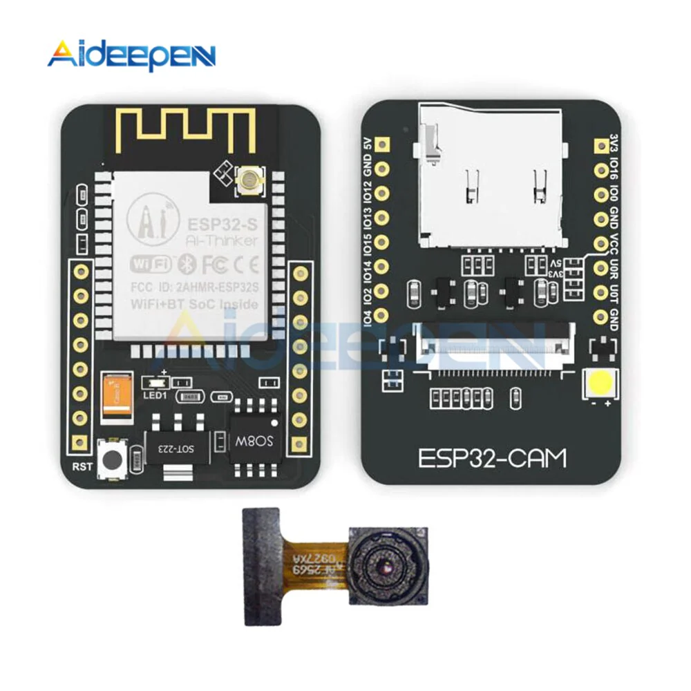

# Test code using ESP32-CAM module (ESP-IDF ver 5.4.0)

Low cost camera:

- [Amazon link](https://www.amazon.ca/dp/B0BPXK9897)
- [HW info](https://www.aideepen.com/products/esp32-cam-wifi-bluetooth-module-with-ov2640-camera-module-development-board-esp32-support-ov2640-and-ov7670-cameras-5v)


# Env settings (Linux)
This demo makes your ESP32-CAM to connect to a Wifi as a Client. Therefore, you need to provide the SSID and password of your Wifi Router bia envvar:
```
source linux-source-me
export WIFI_SSID=<your_wifi_ssid>
export WIFI_PASSWORD=<your_wifi_password>
```
# Init submodule
```
git submodule update --init --recursive --progress
```

# To build
```
idf.py build
```

# To run
```
idf.py flash monitor
```
Note: you may need to provide the port parameter, ex: "idf.py -p /dev/ttyUSB1 flash monitor"

# To connect
You sould be able to see the ESP32-CAM IP that your router has assigned for it in the monitor (shell):
```
I (1859) wifi:<ba-add>idx:0 (ifx:0, 0c:ac:8a:06:51:5f), tid:7, ssn:1, winSize:64
I (2869) esp_netif_handlers: sta ip: 192.168.2.239, mask: 255.255.255.0, gw: 192.168.2.1
I (2869) Connect_WiFi: got ip:192.168.2.239
```

Just write down the IP in your Browser Address Bar: http://your_cam_ip
<br>
For the above example:
```
http://192.168.2.239
```
You should get a video in your browser (made by JPEG pictures sequence)

# Original link:
https://esp32tutorials.com/esp32-cam-esp-idf-live-streaming-web-server/

# Pictures


# Pinout


